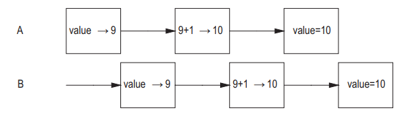

# Introduction

* [Brief history of concurrency](#11-brief-history-of-concurrency)
* [Advantages of using threads](#12-advantages-of-using-threads)
    * [Usage of multiple processors](#121-usage-of-multiple-processors)
    * [Modeling simplicity](#122-modeling-simplicity)
    * [Easier async events](#123-easier-async-events)
    * [Responsive GUI apps](#124-responsive-gui-apps)
* [Risks of threads](#13-risks-of-threads)
    + [Safety hazards](#131-safety-hazards)
    + [Liveness hazards](#132-liveness-hazards)
    + [Performance hazards](#133-performance-hazards)
* [Threads are everywhere](#14-threads-are-everywhere)

Creating apps has always been hard, but concurrent ones even harder.

But it is essential to know how to write them correctly, since it will allow
you to leverage full potential of multiprocessor systems.

## 1.1 Brief history of concurrency

---

Initially, computers where designed to execute only one program at a time, the program had
access to all the resources at once.

Later on, OSes unlocked the ability to run multiple programs at a time in scope of `processes`,
which were isolated, independent and used resources of the OS: memory, file descriptors, etc.

Interconnection between processes is possible with the help of:

* sockets;
* semaphores;
* signals (and their handlers);
* shared memory;
* files;
* etc.

Why did we experience evolution?

* **Resource Utilization** - another program can execute while you're waiting for network I/O
* **Fairness** - Multiple users using the system should have the same share of system resources available to them
* **Convenience** - It is often more desirable to have multiple programs, executing small tasks rather than one big
  program executing all tasks

The way OS-es handled parallel processes is what inspired the use of threads in programs.
So the **thread**'s (a.k.a. lightweight process) features are:

* shared use of process resources (e.g. address space);
* 1 thread - 1 PC (program counter);
* 1 thread - 1 stack;
* 1 thread - own local variables;
* share same objects from heap;
* can make use of multiple processors to achieve HW parallelism.

`But without explicit synchronization, threads can modify variables, that are already used
by another threads with unexpected consequences.`

## 1.2 Advantages of using threads

---

With the right use - threads can:

* decrease cost of development and support
* boost performance

Threads improve responsiveness in GUI apps.
Additionally, threads are used to better utilize available resources & throughput in server applications.

### 1.2.1 Usage of multiple processors

---

Multiprocessor systems tend to become more and more available (cheaper, because it is hard to scale).

Single-threaded application = 1 processor. So if the machine has N = 100
You are losing 99% of resources.

Even in single-processor systems, multithreaded programs can be useful when e.g.
you have to wait for file I/O & want to do another task in the meantime.

`Reading a newspaper while boiling the water.`

### 1.2.2 Modeling simplicity

---

It is usually simpler when it is needed to handle only 1 type of issue.
It is good to decompose complex task into several simple ones that can leverage the use of threads.

Servlets are designed this way (https://www.jenkov.com/tutorials/java-servlets/servlet-concurrency.html)

### 1.2.3 Easier async events

---

Developing a server application that accepts multiple socket connections from remote clients
will become easier if a separate thread is assigned to each connection and allows the use
of blocking (synchronous) I/O.

`Single-threaded app with blocking call =` https://youtu.be/glkSGJU-yLw?t=82

To avoid this, single-threaded apps often use non-blocking I/O which in fact
much harder and more error-prone.

Earlier there was a limit of threads per process (~100) - multiplexing as solution (see `select` and `poll` in Unix):

`I/O multiplexing refers to the concept of processing multiple input/output
events from a single event loop, with system calls like poll and select (Unix).`

Now the situation changed a little and it is available to run ***thousands*** of threads.
See NPTL threads (https://en.wikipedia.org/wiki/Native_POSIX_Thread_Library).

### 1.2.4 Responsive GUI apps

---

Briefly about Swing case (https://docs.oracle.com/javase/tutorial/uiswing/concurrency/initial.html):

* In Swing programs, the initial threads don't have a lot to do.
  Their most essential job is to create a Runnable object that initializes the GUI and schedule that object for
  execution
  on the **event dispatch thread (EDT)**. Once the GUI is created, the program is primarily driven by GUI events,
  each of which causes the execution of a short task on the event dispatch thread.

Application code can:

* schedule additional tasks on the event dispatch thread (if they complete quickly, so as not to interfere with event
  processing);
* worker thread (for long-running tasks).

## 1.3 Risks of threads

---

Thread-safety is really important when it comes to concurrent applications.

### 1.3.1 Safety hazards

---

1 code behaves differently in 1-threaded and N-threaded (N > 1) environments.

```java

@NotThreadSafe
public class UnsafeSequence {
    private int value;

    public int getNext() {
        return value++;
    }
}
```



Essentially there are 3 operations:

* read;
* increment;
* write.

So the threads can read one value (e.g 9) at the same time and as the result return same value (e.g. 10).

This is also known as `race condition` and the returned value depends
on how operations are being punctuated by the environment.

Synchronization:

```java

@ThreadSafe
public class Sequence {
    @GuardedBy("this")
    private int nextValue;

    public synchronized int getNext() {
        return nextValue++;
    }
}
```

In the absence of synchronization, the compiler, HW, and the production environment are allowed to make assumptions
about the temporal coordination and ordering of actions, such as caching variables
in registers or processor-local caches (L1, L2), where actions are temporarily (or even permanently)
not visible to other threads.

These tweaks help improve performance and are generally desirable, but
they put a burden on the developer, whose job it is to clearly
identify where data is shared between threads.

### 1.3.2 Liveness hazards

---

Hard to track them, they occur when special conditions/coordination takes place.

Some examples:

* infinite cycle;
* A waits for resource which B holds exclusively (always);
* deadlock;
* hunger;
* active lock;
* etc.

### 1.3.3 Performance hazards

---

Even though multithreaded apps can improve permormance, the incorrect usage can severely decrease it.
For example with `context switches` (save/restore execution context frequently? = $$).

## 1.4 Threads are everywhere

---
Examples of frameworks & tools, demanding you write thread-safe code:

* Spring;
* JSPs / Servlets;
* Timer class;
* Swing/AWT;
* etc.
